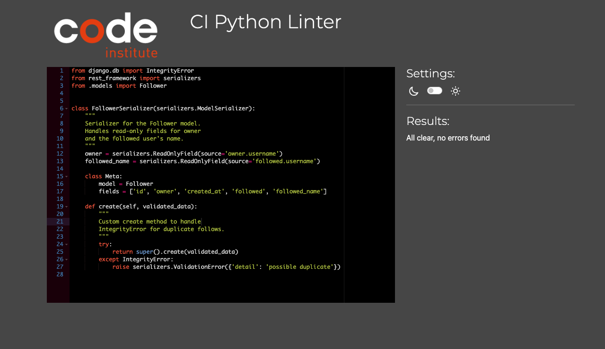

# Foorky 2.0 - Backend

Foorky 2.0 is an advanced full-stack web application designed to help users manage and share their recipes. This backend API provides all the core functionality for recipe management, user profiles, likes, followers, and comments, including secure user authentication and CRUD operations. It is built using Django Rest Framework (DRF), PostgreSQL, and includes JWT authentication via `dj-rest-auth`.

[Deployed api](https://project5-api-a299de19cbb3.herokuapp.com/)
[Repository](https://github.com/davidb3rgqvist/project5_api)

## Table of Contents
- [Project Overview](#project-overview)
- [Backend User Stories](#Backend-user-stories)
- [Database Structure](#database-structure)
- [Key Features](#key-features)
- [Technology Used](#technology-used)
- [Installation](#installation)
- [API Endpoints](#api-endpoints)
- [Testing](#testing)
- [Deployment](#deployment)
- [Credits](#credits)

## Project Overview

The backend of Foorky 2.0 is the backbone of the recipe management system. It handles all API requests, user authentication, and the storage of recipes, likes, comments, followers, and user profiles. It is designed to be scalable, secure, and modular, making it easy for developers to contribute and extend functionality. The backend communicates with the frontend via RESTful API calls, providing the essential operations needed for recipe management.

## Backend User Stories

| Category     | As a              | I want to                                  | So that I can                                  | Endpoints / Features                               |
|--------------|-------------------|--------------------------------------------|------------------------------------------------|---------------------------------------------------|
| Auth         | User               | Register for an account                    | Access my personal profile and share recipes   | POST /auth/users/, POST /auth/token/login/         |
| Auth         | User               | Log in to my account                       | Access my personal feed and interact with recipes | POST /auth/token/login/                            |
| Auth         | User               | Log out of my account                      | Ensure my session is secure                    | POST /auth/token/logout/                           |
| Recipes      | User               | Create a recipe                            | Share my favorite meals with others            | POST /recipes/                                     |
| Recipes      | User               | View a list of recipes                     | Browse through recipes shared by all users     | GET /recipes/                                      |
| Recipes      | User               | View a specific recipe                     | See the ingredients and instructions for a selected recipe | GET /recipes/{id}/                                 |
| Recipes      | User               | Edit a recipe I created                    | Correct any mistakes in my recipe              | PUT /recipes/{id}/, PATCH /recipes/{id}/           |
| Recipes      | User               | Delete my recipe                           | Remove recipes I no longer want to share       | DELETE /recipes/{id}/                              |
| Recipes      | User               | Search for recipes                         | Find recipes based on ingredients, title, or cuisine type | GET /recipes/?search=<query>                       |
| Likes        | User               | Like a recipe                              | Show my appreciation for a specific recipe     | POST /recipes/{id}/like/                           |
| Likes        | User               | Unlike a recipe                            | Remove my like from a recipe                   | DELETE /recipes/{id}/unlike/                       |
| Comments     | User               | Add a comment to a recipe                  | Share my thoughts on a recipe                  | POST /recipes/{id}/comments/                       |
| Comments     | User               | Edit or delete my comment                  | Correct or remove comments I made on recipes   | PUT /comments/{id}/, DELETE /comments/{id}/        |
| Profiles     | User               | View a user profile                        | See the recipes and activity of a specific user | GET /profiles/{id}/                                |
| Followers    | User               | Follow another user                        | Keep track of their new recipes and updates    | POST /profiles/{id}/follow/                        |
| Followers    | User               | Unfollow a user                            | Stop receiving updates on their new recipes    | DELETE /profiles/{id}/unfollow/                    |
| Feeds        | User               | View recipes from users I follow           | Keep up with my favorite users' latest recipes | GET /recipes/?following=true                       |
| Saved Recipes| User               | Save a recipe to my list                   | Keep track of recipes I want to try later      | POST /recipes/{id}/save/                           |
| Saved Recipes| User               | Remove a saved recipe                      | Clean up my saved recipe list                  | DELETE /recipes/{id}/unsave/                       |


## Database Structure

The database consists of several custom models designed to handle user interactions with the platform:

1. **User**: Manages user authentication and personal information.
2. **Profile**: Stores additional user information like name, image, and content.
3. **Recipe**: Handles all recipe-related data, including ingredients, steps, and cook time.
4. **Comment**: Allows users to comment on recipes.
5. **Like**: Tracks user likes on recipes.
6. **Follower**: Manages followers between users, enabling a social interaction feature.

### Entity-Relationship Diagram

Below is the ERD that outlines the relationships between the various models:


### CRUD Functionality
- The backend fully supports CRUD (Create, Read, Update, Delete) operations for all resources, including `recipes`, `comments`, `likes`, and `profiles`.

## Key Features

- **User Authentication**: Secure user registration, login, and logout using JWT.
- **Recipe Management**: Create, update, and delete recipes, with features like ingredients and steps.
- **Comments**: Users can comment on recipes and engage in discussions.
- **Likes**: Users can like recipes, with counts of likes displayed for each recipe.
- **Followers**: Users can follow each other, creating a network of culinary enthusiasts.
- **Profile Management**: Update profile details and view other users' profiles.
- **Search and Filtering**: Search recipes by ingredients, titles, or descriptions, and filter based on difficulty or cook time.

## Technology Used

- **Backend**: Django Rest Framework (DRF) for building RESTful APIs.
- **Database**: PostgreSQL for managing data.
- **Authentication**: JWT Authentication via `dj-rest-auth` for secure login.
- **Cloud Storage**: Cloudinary for storing and serving images.
- **Deployment**: Heroku for hosting the backend.

## Installation

1. **Clone the Repository**:
    ```bash
    git clone https://github.com/davidb3rgqvist/project5_api
    cd foorky-2.0-backend
    ```

2. **Create a Virtual Environment**:
    ```bash
    python -m venv env
    source env/bin/activate
    ```

3. **Install Dependencies**:
    ```bash
    pip install -r requirements.txt
    ```

4. **Set Up PostgreSQL Database**:
    Update your `settings.py` with your local PostgreSQL database credentials or set the `DATABASE_URL` environment variable.

5. **Apply Migrations**:
    ```bash
    python manage.py migrate
    ```

6. **Create Superuser (Optional)**:
    ```bash
    python manage.py createsuperuser
    ```

7. **Run the Development Server**:
    ```bash
    python manage.py runserver
    ```

## Backend API Endpoints

| Endpoint                           | Method          | Description                                                     |
|------------------------------------|-----------------|-----------------------------------------------------------------|
| **Admin and Authentication**                                                                                           |
| `/admin/`                          | N/A             | Admin interface for the Django application                      |
| `/api-auth/`                       | N/A             | DRF browsable API login                                          |
| `/dj-rest-auth/`                   | N/A             | Endpoints for login, logout, password reset, etc.                |
| `/dj-rest-auth/registration/`      | N/A             | User registration                                                |
| **Recipe Endpoints**                                                                                                    |
| `/recipes/`                        | `GET`, `POST`   | List all recipes or create a new recipe                          |
| `/recipes/by_profile/`             | `GET`           | List recipes filtered by user profile                            |
| `/recipes/(?P<pk>[^/.]+)/`         | `GET`, `PUT`, `DELETE` | Retrieve, update, or delete a specific recipe by ID             |
| **Comment Endpoints**                                                                                                   |
| `/comments/`                       | `GET`, `POST`   | List all comments or create a new comment                        |
| `/comments/(?P<pk>[^/.]+)/`        | `GET`, `PUT`, `DELETE` | Retrieve, update, or delete a specific comment by ID            |
| **Ranked Liked Recipes**                                                                                                |
| `/ranked-liked-recipes/`           | `GET`           | List liked recipes by the user, ranked by the number of likes     |
| **Likes Endpoints**                                                                                                     |
| `/likes/`                          | `POST`          | Like a recipe                                                    |
| `/likes/list/`                     | `GET`           | List all liked recipes by the user                               |
| `/likes/<int:recipe_id>/`          | `DELETE`        | Unlike a recipe by recipe ID                                     |
| **Profile Endpoints**                                                                                                   |
| `/profiles/`                       | `GET`           | List all profiles                                                |
| `/profiles/<int:pk>/`              | `GET`, `PUT`, `DELETE` | Retrieve, update, or delete a specific profile by ID            |
| **Followers Endpoints**                                                                                                 |
| `/followers/`                      | `GET`, `POST`   | List all followers or follow a user                              |
| `/followers/<int:pk>/`             | `DELETE`        | Unfollow a user by ID                                            |

---

## Testing

Manual and automated testing was done to ensure the stability and functionality of the backend.

- **Unit Tests**: Created using Django's `TestCase` framework.
- **API Tests**: Utilized Django Rest Framework's `APITestCase` to validate the behavior of API endpoints.
- **Manual Testing**: Performed on the deployed version to ensure all API endpoints are functioning correctly with the frontend.

### Manual Testing

Below is the table documenting the manual testing conducted for various API endpoints, covering CRUD operations, authentication, and permissions.

| **Test Case**                        | **Endpoint**                     | **Method** | **Description**                                                     | **Expected Result**                                                                 | **Pass/Fail** |
|--------------------------------------|----------------------------------|------------|---------------------------------------------------------------------|------------------------------------------------------------------------------------|---------------|
| **User Registration**                | `/dj-rest-auth/registration/`    | `POST`     | Register a new user with username, email, and password.              | User is successfully registered, and a token is returned.                         | Pass          |
| **User Login**                       | `/dj-rest-auth/login/`           | `POST`     | Log in an existing user.                                             | User is successfully logged in, and a token is returned.                          | Pass          |
| **Create Recipe**                    | `/recipes/`                      | `POST`     | Create a new recipe (with valid token).                              | Recipe is successfully created and is associated with the logged-in user.         | Pass          |
| **List All Recipes**                 | `/recipes/`                      | `GET`      | Retrieve all recipes.                                                | A list of all recipes is returned.                                                | Pass          |
| **Retrieve Single Recipe by ID**     | `/recipes/1/`                    | `GET`      | Retrieve a specific recipe by its ID.                                | The recipe with the given ID is returned.                                         | Pass          |
| **Update Recipe (Owner)**            | `/recipes/1/`                    | `PUT`      | Update an existing recipe (owned by the logged-in user).              | Recipe is successfully updated.                                                   | Pass          |
| **Update Recipe (Not Owner)**        | `/recipes/2/`                    | `PUT`      | Try to update a recipe owned by another user.                        | User is forbidden from updating the recipe (403 error).                           | Pass          |
| **Delete Recipe (Owner)**            | `/recipes/1/`                    | `DELETE`   | Delete a recipe (owned by the logged-in user).                        | Recipe is successfully deleted.                                                   | Pass          |
| **Delete Recipe (Not Owner)**        | `/recipes/2/`                    | `DELETE`   | Try to delete a recipe owned by another user.                        | User is forbidden from deleting the recipe (403 error).                           | Pass          |
| **Add Comment to Recipe**            | `/comments/`                     | `POST`     | Add a comment to a specific recipe.                                  | Comment is successfully added to the recipe.                                      | Pass          |
| **List All Comments for Recipe**     | `/comments/`                     | `GET`      | Retrieve all comments for a specific recipe.                         | A list of comments for the recipe is returned.                                    | Pass          |
| **Like a Recipe**                    | `/likes/`                        | `POST`     | Like a recipe (valid token).                                         | Recipe is successfully liked, and the like is associated with the user.           | Pass          |
| **Unlike a Recipe**                  | `/likes/1/`                      | `DELETE`   | Unlike a previously liked recipe.                                    | Recipe is successfully unliked.                                                   | Pass          |
| **Follow a User**                    | `/followers/`                    | `POST`     | Follow another user.                                                 | User is successfully followed, and a follower relationship is created.            | Pass          |
| **Unfollow a User**                  | `/followers/1/`                  | `DELETE`   | Unfollow a user.                                                     | User is successfully unfollowed.                                                  | Pass          |
| **Permissions Test: Update Own Profile** | `/profiles/1/`                | `PUT`      | Update profile information (for logged-in user).                     | Profile is successfully updated.                                                  | Pass          |
| **Permissions Test: Update Another User's Profile** | `/profiles/2/`         | `PUT`      | Try to update another user's profile.                                | User is forbidden from updating the profile (403 error).                          | Pass          |

### Code Quality
- All backend Python code adheres to the PEP8 style guide.
- We used `https://pep8ci.herokuapp.com/` to ensure that the code is properly linted and free of major style violations.



## Deployment

The backend for Foorky 2.0 is deployed using **Heroku**, ensuring that the API is accessible for the frontend. Follow these steps to deploy the backend:

1. **Set Up Heroku**:
    - Sign up for a Heroku account at [Heroku](https://www.heroku.com/).
    - Create a new Heroku app from the dashboard.

2. **Link GitHub Repository**:
    - In your Heroku app settings, connect your GitHub repository for continuous deployment.
    - Enable automatic deployments if you want Heroku to redeploy every time you push changes to the GitHub repository.

3. **Configure PostgreSQL**:
    - Add the **PostgreSQL** add-on from Heroku’s resources tab.
    - Heroku will automatically configure the `DATABASE_URL` environment variable. Ensure this is used in your Django settings to point to the correct database.

4. **Environment Variables**:
    - Set environment variables in the Heroku dashboard under the "Settings" tab.
    - Include sensitive variables like `SECRET_KEY`, `CLOUDINARY_URL`, and `DEBUG=False` (for production).
    - Example environment variables:
      ```bash
      SECRET_KEY=your-secret-key
      CLOUDINARY_URL=cloudinary://your-api-key
      DEBUG=False
      ```

5. **Deploy the Application**:
    - In your Heroku app dashboard, trigger a manual deployment to your connected GitHub repository.

6. **Verify Deployment**:
    - Check that your app is live by visiting the Heroku URL provided. Ensure all API endpoints are functioning and connected to your frontend application.

## Credits

- **Code Institute**: The **Django REST Framework (DRF) API Walkthrough** project served as an inspiration and foundation for the development of the Foorky 2.0 backend.
- **Django REST Framework**: For building a flexible, powerful API system with support for authentication and permissions.
- **Heroku**: For cloud hosting and managing deployments easily with GitHub integration.
- **Cloudinary**: Used for storing and delivering media files such as images.
- **PostgreSQL**: The database management system that stores all structured data related to users, recipes, comments, likes, and followers.

This project is a collaborative effort built on open-source technologies and the support of the developer community. Special thanks to tutorials, mentors, and resources that guided the creation of this full-stack web application.
